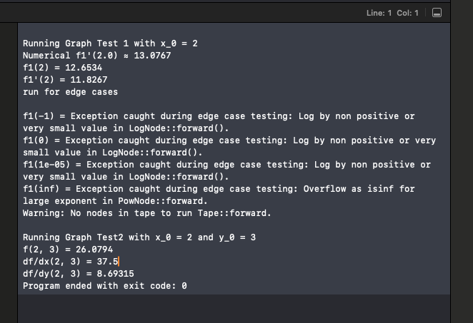

## Project Structure
 - main.cpp: The main entry point for the project with test scenarios: one variable function, two variable function, cut edge scenairos described below
 
- Tape.hpp / Tape.cpp: Implements the Tape class to store and manage operations.

- nodes/: Contains all the node classes representing operations (AddNode, ConstantNode, DivNode, LogNode, MulNode, PowNode, SubNode, VariableNode).

## Tape Class  
- The Tape class is responsible for performing forward and backward passes to compute values and gradients and also includes error handling to display warnings if no nodes are available for computation. 
- Forward Pass: computes the output values of each node using the forward() method.
- Backward Pass: computes gradients using backpropagation with the backward() method.
- Memory Management: is handled by the destructor, ensuring dynamically created nodes are properly deallocated.

## Node Class Overview

- Node (base) Class: is an abstract class with pure virtual functions forward() and backward() that derived classes override to perform specific operations using the attributes value and grad. Each node stores its computed value and gradient, accessible using getValue() and getGrad().
- Polymorphism: Derived classes (AddNode, ConstantNode, DivNode, LogNode, MulNode, PowNode, SubNode, VariableNode) implement their own operation logic for Value and Gradient, supporting the computational graph.

## Script Implementation:
Create a Tape object as first step:  ``` Tape tape; ``` then build up computational graph as below. 
### Examples of Computational Graph Breakdown for one variable and two variables:
#### One Variable: 
runGraphTest1: f(x) = (5 + x^3) + (ln((x^2 - 5) * (4 - 3 * x)) / (x - 4))

 1. Variable Initialization:

 ```cpp
    auto x = tape.create<VariableNode>(x_0);
 ```
 2. Operations of Power, Constants, SubNode, MulNode, Logarithm and Division:

 ```cpp
    // x^2
    auto x2 = tape.create<PowNode>(x, 2.0);
    // (x^2 - 5)
    auto c5 = tape.create<ConstantNode>(5.0);
    auto left = tape.create<SubNode>(x2, c5);
    
    // (3 * x)
    auto c3 = tape.create<ConstantNode>(3.0);
    auto tmp = tape.create<MulNode>(c3, x);
    
    // (4 - 3 * x)
    auto c4 = tape.create<ConstantNode>(4.0);
    auto right = tape.create<SubNode>(c4, tmp);
    // (x^2 - 5) * (4 - 3 * x)
    auto mult = tape.create<MulNode>(left, right);

     // ln((x^2 - 5) * (4 - 3 * x))
    auto ln_part = tape.create<LogNode>(mult);
    
    // (x - 4)
    auto denom = tape.create<SubNode>(x, c4);
    //  ln_part / denom 
    
    auto fraction = tape.create<DivNode>(ln_part, denom);
     // x^3 
    auto x3 = tape.create<PowNode>(x, 3.0);
    
    // 5 + x^3 using AddNode
    auto tmp2 = tape.create<AddNode>(c5, x3);
    //final: (5 + x^3) + (ln_part / denom) using AddNode
    auto final = tape.create<AddNode>(tmp2, fraction);
```

 3. Forward and Backward Pass:
```cpp
    tape.forward();
    tape.backward();
```
 4. Output: returns a vector containing:
```cpp
    // result of forward: f(x)
    final->getValue();
    
    // result of gradient: df(x)
    x->getGrad();
```


#### Two Variables: 
runGraphTest2: `f(x,y) = x^3 * y+ln(x) * y`
1. Variable Initialization:

 ```cpp
    auto x = tape.create<VariableNode>(x_0);
    auto y = tape.create<VariableNode>(y_0);
```
   
2. Operations of PowNode, LogNode and MulNode Nodes:

 ```cpp
    // x^3 
    auto x3 = tape.create<PowNode>(x, 3.0);
    
    // ln(x) 
    auto ln_x = tape.create<LogNode>(x);
    
    // x^3 * y 
    auto x3y = tape.create<MulNode>(x3, y);
    
    // ln(x) * y
    auto ln_xy = tape.create<MulNode>(ln_x, y);
    
    // computation: x^3 * y + ln(x) * y using AddNode
    auto final = tape.create<AddNode>(x3y, ln_xy);
```

3. Forward and Backward Pass:
```cpp
    tape.forward();
    tape.backward();
```
4. Output: returns a vector containing:
```cpp
    // result of forward: f(x,y)
    final->getValue();
    
    // result of gradient: df(x)
    x->getGrad();
    
    // result of gradient: df(y)
    y->getGrad()
```
#### Edge Case Testing: 

The edge cases are tested by evaluating the function at extreme values of x, including zero,near-zero, and large values, as well as testing with an empty Tape.
1. x = -1:
   - Issue: ln(x) result in mathematical errors
   - Expected Behavior: function should throw error massage

2.  x = 0:
   - Issue: ln(x) and division by /x result in mathematical errors
   - Expected Behavior: function should throw error massage

3. x = 0.00001:
   - Issue: ln(x) and division by /x result in mathematical errors
   - Expected Behavior: function should throw error massage

4. x = pow(10, 100000):
   - Warning: n as an extremely large number could lead to overflow errors for x^n
   - Expected Behavior:  function should throw error massage
5. Empty Tape:
   - Warning: no nodes are created in the Tape, will trigger a warning such as "No nodes in tape to run forward." No forward or backward pass can be performed.
   - Expected Behavior:  function should print a warning or error without crashing, ensuring the system does not proceed with invalid operations.

5. Code Example:
```cpp
// run for edge case as x = -1, x = 0, x = 0.0001, x= pow(10,1000000) and empty Tape
    std::cout << "run for edge cases \n" << std::endl;
    std::vector<double> arr = {-1, 0, 0.00001, std::pow(10, 100000)};
    for (int i = 0; i < arr.size(); ++i){
        try {
                std::cout << "f1(" << arr[i] << ") = " << runGraphTest1(arr[i])[0] << std::endl;
                std::cout << "f1'(" << arr[i] << ") = " << runGraphTest1(arr[i])[1] << std::endl;
            } catch (const std::exception& e) {
                std::cerr << "Exception caught during edge case testing: " << e.what() << std::endl;
            }
       
    }
    Tape tape;
    // a warning: No nodes in tape to run forward.
    tape.forward();
```

## Results 
Test cases results are all acceptable and please refer the screenshot: 



